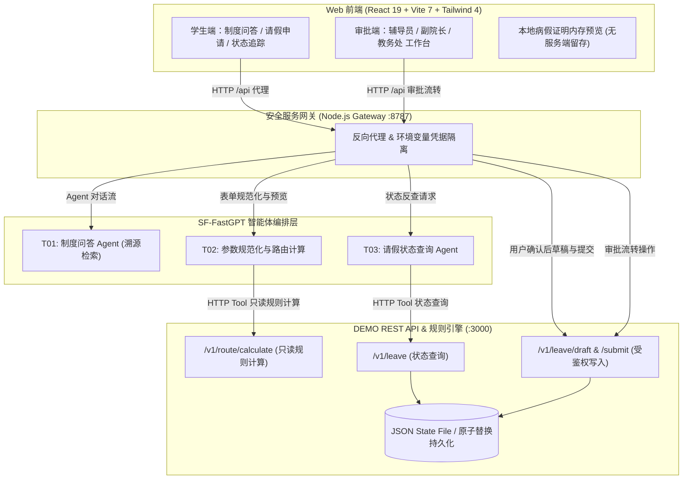
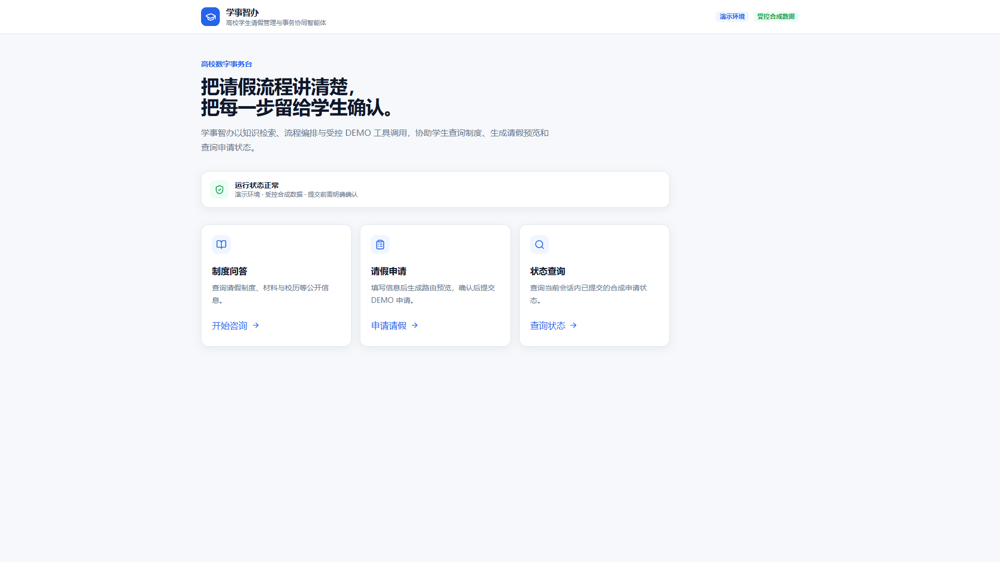
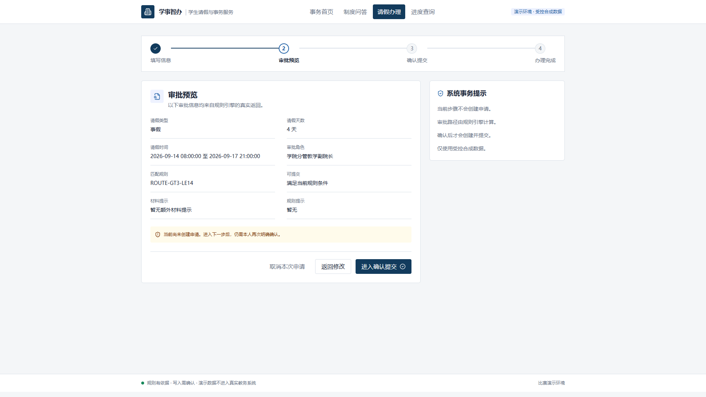
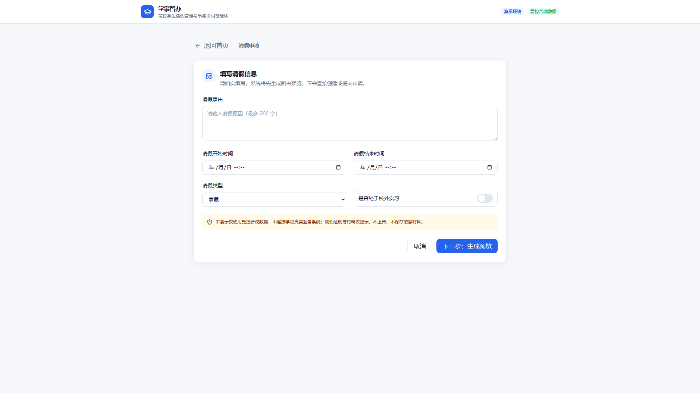
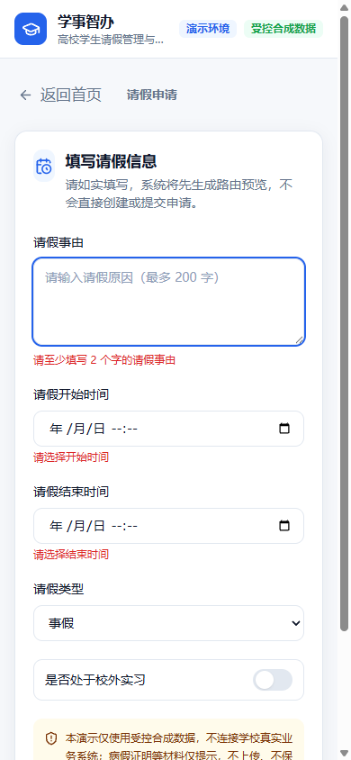

# 学事智办 · 高校学生请假管理与事务协同智能体

<div align="center">

[](LICENSE)
[](contest_demo_web/)
[](contest_demo_web/)
[](external_mock_api/)
[](docs/architecture/)
[](.github/workflows/ci.yml)
[](https://student-affairs.serendipituwpt.art)

**A Controlled Multi-Agent Architecture for Institutional Policy Q&A, Human-in-the-Loop Leave Applications, Multi-Role Collaborative Approval, and Status Tracking.**

[在线演示 (Live Demo)](https://student-affairs.serendipituwpt.art) • [安全模型 (Security Model)](docs/security/OPEN_SOURCE_SECURITY_MODEL.md) • [架构设计 (Architecture)](docs/architecture/) • [快速开始 (Quick Start)](#-快速开始-quick-start) • [部署指南 (Deployment)](docs/deployment/environment.md)

</div>

---

## 📖 1. 项目简介 (Overview)

高校学生请假与事务审批具有**政策规则复杂**（按假别、天数、实习状态分级流转）、**审批链条长**（辅导员 ➔ 教学副院长 ➔ 教务处）、**医疗隐私敏感**等典型特征。传统请假系统缺乏即时政策咨询，而通用大模型若直接连接写接口则存在规则幻觉与误操作风险。

**“学事智办”** 是基于 **SF-FastGPT** 与现代化 Web 架构打造的高校学生事务协同智能体系统，采用**“结构化收集 ➔ 确定性路由 ➔ 审批预览 ➔ 确认后直接写入 ➔ 协同工作台”**的闭环架构：
- **T01 制度问答智能体**：基于《学生手册》知识库，提供带精确 Markdown 溯源引用的规章问答；
- **T02 请假申请智能体**：收集结构化请假信息（包括事由、时段、假别、校外实习状态及病假材料声明等），通过规则引擎计算审批路径并回显预览，经用户明确确认后直接调用后端 API 创建草稿并提交；Main Agent 本身不挂载写工具，未确认或取消时 0 次调用写 API；
- **T03 状态追踪智能体**：提供基于申请单号的实时状态反查与审批流时间线可视化；
- **协同审批工作台**：辅导员、教学院长与教务部门的一站式审批看板，支持本地病假证明内存安全预览。

---

## 🌟 2. 核心特性 (Key Features)

- 🔒 **受控写入与安全边界 (Controlled Safe Mutation)**：Main Agent 不挂载写操作工具，草稿创建与提交仅在用户确认表单后通过服务端直接调用受鉴权 API，取消分支保持零写入；
- 🩺 **本地医疗隐私保护 (Zero-PHI Local Preview)**：病假证明文件仅在浏览器端内存加载用于界面预览，不经服务端存储，从机制上避免健康隐私数据在演示服务中留存；
- 📑 **手册规则矩阵对齐 (Handbook Rule Alignment)**：
  - **普通请假 $\le 3$ 天** ➔ 辅导员审批；
  - **普通请假 $> 3$ 天且 $\le 1$ 个自然月** ➔ 辅导员 ➔ 学院分管教学副院长；
  - **普通请假 $> 1$ 个自然月** ➔ 系统提示转人工办理休学手续；
  - **校外实习（任意时长）** ➔ 辅导员 ➔ 学院分管教学副院长 ➔ 教务处；
  - **病假证明** ➔ 作为可选材料声明，无证明仍可提交草稿，审核人可根据需要要求补充。
- 🖥️ **现代前端交互架构 (Modern Web Interface)**：基于 React 19、Vite 7 与 Tailwind CSS 4 构建，提供清晰的学生端办理门户与分角色审批工作台。

---

## 🏛️ 3. 系统架构 (System Architecture)



---

## 📂 4. 仓库结构 (Repository Structure)

```text
.
├── contest_demo_web/         # React 19 + TypeScript 5 + Vite 7 学生端与审批工作台前端
├── contest_demo_gateway/     # Node.js 20 服务端网关（实现凭证隔离与反向代理）
├── external_mock_api/        # 基于 Node.js 标准库的请假 REST API 与规则引擎（零额外 npm 依赖）
├── mock_api/                 # Python 3.11 备用服务端实现与回归测试套件
├── docs/                     # 架构设计、安全模型、部署规范与精选截图
│   ├── architecture/         # 系统架构与时序设计
│   ├── security/             # 安全模型与开源预检审计报告
│   ├── deployment/           # 部署与环境变量配置规范
│   └── screenshots/          # 系统演示截图
├── scripts/                  # 开源自检与自动化审计脚本 (PowerShell & Bash)
├── .github/                  # GitHub Actions CI、CodeQL、Dependabot 与 Issue 模板
├── SECURITY.md               # 开源安全策略与漏洞提报规范
├── CONTRIBUTING.md           # 贡献指南与代码规范
├── THIRD_PARTY_NOTICES.md    # 第三方开源依赖归属与许可声明
├── CHANGELOG.md              # 版本演进记录
├── NOTICE                    # Apache-2.0 归属声明
└── LICENSE                   # 官方完整 Apache-2.0 开源许可证
```

---

## 🚀 5. 快速开始 (Quick Start)

### 依赖环境
- **Node.js**: `v20.x` 或更高版本
- **Python**: `3.11.x` (用于运行 Python 备用服务端单测)
- **Git**

### 本地启动三件套 (Local Development)

> [!NOTE]
> 本地完整运行 AI 智能体功能需要您准备自己的 SF-FastGPT 应用与 API Key；若未配置 FastGPT 凭证，安全网关将提示缺少配置，而 Mock API 与独立规则引擎仍可完整运行测试。

#### 步骤 1：启动 Mock API 规则服务
```bash
cd external_mock_api
# external_mock_api 为 Node.js 原生零额外依赖实现
npm start        # 默认监听 http://127.0.0.1:3000
```

#### 步骤 2：启动安全服务网关
```bash
cd ../contest_demo_gateway
cp .env.example .env   # 配置您的 FastGPT 凭证与 DEMO_API_TOKEN
npm start              # 默认监听 http://127.0.0.1:8787
```

#### 步骤 3：启动 Web 前端门户
```bash
cd ../contest_demo_web
npm ci
npm run dev            # 访问 http://localhost:5173 (自动代理 /api 至 8787)
```

---

## 🧪 6. 自动化测试 (Automated Testing)

本仓库内置全量自动化回归测试套件：

```bash
# 1. 运行 Node.js 12 项综合集成与规则矩阵测试 (覆盖全部 24 个断言检查点)
node --test external_mock_api/test/*.test.mjs

# 2. 运行 Python 11 项备用服务端规则测试
python mock_api/test_server.py

# 3. 运行本地开源合规与安全自检脚本 (PowerShell)
powershell scripts/open-source-audit.ps1
```

**实测结果**：
- Node.js 集成测试：`12/12 PASS (100%)`
- Python 备用单测：`11/11 PASS (100%)`
- 规则矩阵覆盖：≤3天辅导员、>3天且≤1个自然月（辅导员→分管教学副院长）、校外实习（辅导员→副院长→教务处三级流转）、>1个自然月转休学提示、病假证明可选、返校销假等边界用例。

---

## 📸 7. 系统界面预览 (Screenshots)

| 学生端首页与政策问答 | 请假表单与规则路径预览 |
| :---: | :---: |
|  |  |

| 多角色审批协同工作台 | 申请单状态时间线 |
| :---: | :---: |
|  |  |

---

## 🔒 8. 演示安全边界声明 (Demo Boundary)

> [!IMPORTANT]
> - **受控合成数据**：本系统所有演示数据（`DEMO-STU-001`, `DEMO-APP-*`）均为受控合成数据，不包含任何真实学生档案信息。
> - **无生产教务连接**：本开源项目用于学生事务协同智能化研究、教学与赛事演示，未接入高校生产教务网或统一身份认证系统。
> - **健康隐私保护**：病假证明文件仅在浏览器端内存加载预览，未在服务器或数据库中建立持久化存储。

---

## 📄 9. 许可证与致谢 (License & Acknowledgements)

- 本项目采用 **[Apache License 2.0](LICENSE)** 开源。
- 详细第三方依赖许可与致谢请参见 **[THIRD_PARTY_NOTICES.md](THIRD_PARTY_NOTICES.md)**。
