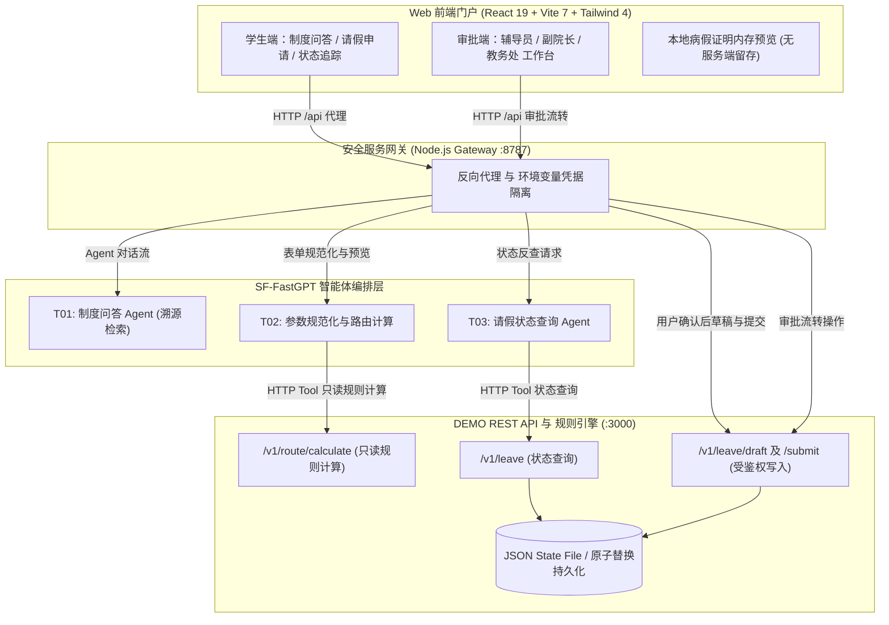

# 学事智办 · 系统架构与多智能体拓扑设计 (System Architecture)

本文档详细描述“学事智办”高校学生事务协同智能体系统的分层架构、数据流向、安全隔离与多角色审批协同机制。

---

## 1. 总体分层架构 (Layered Architecture)

系统采用**“浏览器端门户 ➔ 安全服务网关 ➔ 智能体编排层 / 规则引擎与状态持久化”**的标准三层架构设计：

---

## 2. 核心智能体职责与交互流 (Multi-Agent Topology)

### 2.1 T01: 制度规章问答智能体 (Policy Q&A Agent)
- **知识库支撑**：基于官方《学生手册》规章制度切片索引，采用混合语义检索与重排。
- **回答规范**：严格带精确 Markdown 引用来源（标注手册条款及页码），杜绝规则幻觉。

### 2.2 T02: 请假申请与闭环智能体 (Leave Application Agent)
- **结构化收集**：收集请假事由、起止时段、假别、校外实习状态及病假材料声明等关键信息。
- **确定性路由**：调用规则引擎 `/v1/route/calculate` 进行确定性审批链计算并生成预览摘要。
- **受控安全写入**：Main Agent 本身不挂载破坏性写工具；必须在获得用户明确确认表单操作后，通过服务端调用受鉴权的 `/v1/leave/draft` 与 `/v1/leave/submit` 接口写入演示数据。取消操作保持零写入。

### 2.3 T03: 状态反查与追踪智能体 (Status Tracking Agent)
- **单号查询**：依据请假申请单号（`DEMO-APP-*`）调用 `/v1/leave/{id}` 接口反查实时状态。
- **时间线回显**：输出结构化审批流转节点、经办角色与审批时间线。

---

## 3. 安全隔离与隐私保护机制 (Security & Privacy)

1. **凭证完全隔离**：SF-FastGPT 平台 API Key 与 DEMO API Bearer Token 仅由服务端安全网关（`contest_demo_gateway`）持有，严禁暴露至浏览器或客户端代码。
2. **零 PHI 医疗隐私保护**：病假证明文件仅在前端浏览器内存（Blob URL）中加载供用户及审核界面本地预览，服务端与数据库不作持久化存储。
3. **合成演示数据**：全系统均采用受控合成数据（`DEMO-STU-001`, `DEMO-APP-*`），未连接任何高校生产教务系统。
