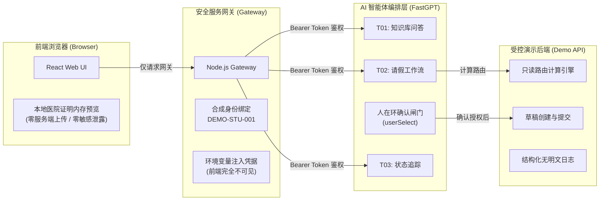

# Open Source Security Model & Defense-in-Depth Architecture

> **Document ID**: `SSA-DOC-SEC-MODEL-001`  
> **Status**: APPROVED  
> **Target Audience**: Security Auditors, Evaluators, Open Source Developers

---

## 1. 核心安全防护原则 (Core Principles)

学事智办（Smart Student Affairs Management）在架构设计上遵循**纵深防御（Defense-in-Depth）**与**零信任凭据隔离（Zero-Trust Credential Isolation）**原则：

---

## 2. 关键安全机制 (Key Security Controls)

### ① 零客户端凭据暴露 (Zero Client-Side Secret Exposure)
- 前端浏览器代码中**严禁包含任何 FastGPT API Key、数据库连接串或后端 Token**。
- 所有 AI 接口调用均由运行在后端的 `contest_demo_gateway` 代理中转，网关通过系统环境变量读取凭证，确保第三方无法通过抓包或逆向工程提取敏感密钥。

### ② 能力层物理隔离与人在环确认闸门 (Capacity-Layer Isolation & Human-in-the-Loop)
- **确认前物理隔离**：在用户确认之前，工作流中挂载的工具集仅包含只读的 `calculateLeaveRoute`，写入接口集合完全为空（$	ext{Pre-Tools} \cap \{	ext{createLeaveDraft}, 	ext{submitLeave}\} = \emptyset$）。
- **人在环确认闸门 (`userSelect`)**：必须由用户在前端明确点击【确认提交】，工作流引擎才会激活写操作分支；若用户选择【返回修改/取消】，系统 0 次调用写 API，绝无数据副作用。

### ③ 医疗隐私本地化防护 (Local Medical Proof Preview)
- 演示中的病假证明预览采用浏览器本地 `URL.createObjectURL` 内存渲染。
- 证明文件不经过后端存储，不进入数据库，不保留云端日志，从根源上杜绝真实医疗隐私（PHI）泄露风险。

### ④ 受控合成数据沙箱 (Controlled Synthetic Data Sandbox)
- 系统运行时严格限定操作受控合成身份（如 `DEMO-STU-001`）。
- 绝不连接学校真实教务生产系统或统一身份认证（SSO），不读取真实学生档案。

### ⑤ 结构化防泄漏日志 (Redacted Structured Logging)
- 后端服务与网关全面移除请求体原始明文日志（`rawText`）。
- 仅记录 `request_id`, `method`, `path`, `status`, `duration_ms` 等脱敏审计元数据。
